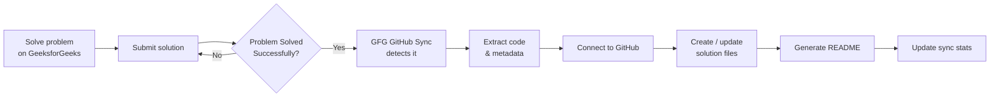
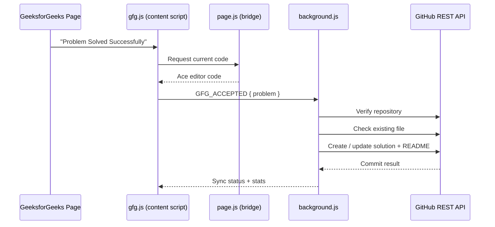
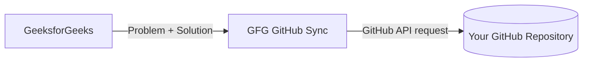

<div align="center">


# GFG → GitHub Sync

### Automatically sync your solved GeeksforGeeks problems to GitHub — zero manual work.

<p>
  
  
  
  
  
</p>

<strong>Solve on GeeksforGeeks. Submit successfully. GFG GitHub Sync handles the backup.</strong>

<br/>

<a href="#-installation">Install</a> ·
<a href="#-key-features">Features</a> ·
<a href="#-how-it-works">How it works</a> ·
<a href="#-usage">Usage</a> ·
<a href="#-troubleshooting">Troubleshooting</a>

</div>

<br/>

<div align="center">

|                                                          Popup Dashboard                                                           |                                                         GitHub Connection                                                          |
| :--------------------------------------------------------------------------------------------------------------------------------: | :--------------------------------------------------------------------------------------------------------------------------------: |
|  |  |
|                                             _Live sync stats, last upload, and status_                                             |                                               _Connect once — username, repo, token_                                               |

</div>

---

## ✨ Overview

**GFG GitHub Sync** is a Chrome extension that automatically backs up accepted **GeeksforGeeks** solutions to a GitHub repository.

Instead of manually copying your solution, creating folders, opening GitHub, and committing files by hand, the extension detects a successful submission and syncs it for you — organized, timestamped, and documented.

Built for developers and students who want a clean, readable GitHub history of their DSA practice.

<br/>



---

## 🚀 Key Features

<table>
<tr>
<td width="50%" valign="top">

### 🔄 Automatic Solution Sync

The moment a GeeksforGeeks problem shows _"Problem Solved Successfully"_, the extension extracts and uploads it — no clicks required.

### 📁 Organized Repository Structure

Solutions are auto-sorted by language and difficulty, so your repo stays readable as it grows:

```text
C++/
├── Easy/
│   ├── Largest-in-Array/
│   │   ├── Largest-in-Array.cpp
│   │   └── README.md
│   └── Missing-Number/
│       ├── Missing-Number.cpp
│       └── README.md
├── Medium/
│   └── Two-Sum-Pair-with-Given-Sum/
│       ├── Two-Sum-Pair-with-Given-Sum.cpp
│       └── README.md
└── Hard/
```

### 📝 Automatic README Generation

Every synced problem gets its own `README.md` with the title, difficulty, statement, examples, and a link back to the source problem.

### ♻️ Smart Update, Not Duplicate

If a solution file already exists, it's **updated in place** rather than creating a second copy.

</td>
<td width="50%" valign="top">

### 📊 Live Solving Statistics

The popup tracks your progress in real time:

<div align="center">

| Synced | Easy | Medium | Hard |
| :----: | :--: | :----: | :--: |
|   7    |  4   |   2    |  0   |

</div>

Plus the last problem synced and how long ago.

### 🔐 Local, Private Configuration

Your GitHub username, repo, and token live in Chrome's local extension storage — never hard-coded, never displayed again after saving.

### ⚠️ Robust Error Handling

Missing config, bad tokens, repo-not-found, permission errors, network failures, upload conflicts, extraction failures — all handled with clear, specific messages.

### 🎯 C++ Focus (for now)

```text
C++/<Difficulty>/<Problem>/<Problem>.cpp
```

Other languages currently fall back to `.txt`.

</td>
</tr>
</table>

---

## 🧩 How It Works

Four components work together to make the sync invisible:

|  #  | Component                                       | Responsibility                                                                                                          |
| :-: | ----------------------------------------------- | ----------------------------------------------------------------------------------------------------------------------- |
|  1  | **Content Script** (`gfg.js`)                   | Watches the GFG page, detects a successful submission, extracts title, URL, difficulty, language, and problem statement |
|  2  | **Page Bridge** (`page.js`)                     | Reaches into GFG's in-page Ace editor to read your current solution code                                                |
|  3  | **Background Service Worker** (`background.js`) | Validates config, verifies repo access, checks for existing files, uploads/updates via the GitHub API, tracks stats     |
|  4  | **GitHub REST API**                             | Receives the file via the Contents API and commits it to your repository                                                |



---

## 🏗️ Project Architecture

```text
GFG GitHub Sync
│
├── manifest.json
│
├── icons/
│   ├── icon16.png
│   ├── icon48.png
│   └── icon128.png
│
└── src/
    ├── background/
    │   └── background.js
    ├── content/
    │   ├── gfg.js
    │   └── page.js
    └── popup/
        ├── popup.html
        ├── popup.css
        └── popup.js
```

<details>
<summary><strong>Component responsibilities</strong></summary>

<br/>

| Component       | Responsibility                                           |
| --------------- | -------------------------------------------------------- |
| `manifest.json` | Extension configuration and permissions                  |
| `gfg.js`        | Detects successful submissions and extracts metadata     |
| `page.js`       | Reads code from the GFG editor                           |
| `background.js` | GitHub API, uploads, README generation, stats and errors |
| `popup.html`    | Extension popup structure                                |
| `popup.css`     | Popup UI styling                                         |
| `popup.js`      | Popup state, connection UI, statistics and sync status   |
| `icons/`        | Extension icons                                          |

</details>

---

## 📦 Installation

**Load the extension locally:**

```bash
git clone https://github.com/coder-nik200/Gfg-Github-Sync.git
cd Gfg-Github-Sync
```

Then in Chrome:

1. Go to `chrome://extensions`
2. Enable **Developer mode** (top right)
3. Click **Load unpacked**
4. Select the project folder containing `manifest.json`
5. Pin **GFG GitHub Sync** to your toolbar

---

## 🔑 GitHub Setup

<table>
<tr>
<td width="33%" valign="top">

### 1. Create a repo

Create a GitHub repository to hold your solutions, e.g. `GeeksforGeeks-Submission`.

</td>
<td width="33%" valign="top">

### 2. Create a token

Generate a GitHub Personal Access Token with the minimum repo permissions you need.

> ⚠️ Never commit or share your token.

</td>
<td width="33%" valign="top">

### 3. Connect it

Open the popup and enter your username, repository URL, and token, then click **Connect GitHub**.

</td>
</tr>
</table>

```text
Username:    coder-nik200
Repository:  https://github.com/coder-nik200/GeeksforGeeks-Submission
```

---

## ▶️ Usage

<table>
<tr><td width="40" align="center"><strong>1</strong></td><td>Open a GeeksforGeeks problem</td></tr>
<tr><td align="center"><strong>2</strong></td><td>Write your solution</td></tr>
<tr><td align="center"><strong>3</strong></td><td>Submit it</td></tr>
<tr><td align="center"><strong>4</strong></td><td>Wait for <code>Problem Solved Successfully</code></td></tr>
<tr><td align="center"><strong>5</strong></td><td>GFG GitHub Sync detects the successful submission</td></tr>
<tr><td align="center"><strong>6</strong></td><td>Solution + metadata are extracted automatically</td></tr>
<tr><td align="center"><strong>7</strong></td><td>Solution and generated README are pushed to GitHub</td></tr>
<tr><td align="center"><strong>8</strong></td><td>The popup updates your sync stats</td></tr>
</table>

---

## 📂 Example Result

```text
GeeksforGeeks-Submission/
└── C++/
    ├── Easy/
    │   ├── Largest-in-Array/
    │   │   ├── Largest-in-Array.cpp
    │   │   └── README.md
    │   ├── Missing-Number/
    │   │   ├── Missing-Number.cpp
    │   │   └── README.md
    │   └── Move-All-Zeroes-to-End/
    │       ├── Move-All-Zeroes-to-End.cpp
    │       └── README.md
    ├── Medium/
    │   └── Two-Sum-Pair-with-Given-Sum/
    │       ├── Two-Sum-Pair-with-Given-Sum.cpp
    │       └── README.md
    └── Hard/
```

---

## 🛡️ Permissions

| Permission                | Used for                                                                                  |
| ------------------------- | ----------------------------------------------------------------------------------------- |
| `storage`                 | GitHub connection settings, sync status, solving statistics                               |
| GeeksforGeeks host access | Detecting submissions, reading problem metadata, accessing the editor via the page bridge |
| GitHub API host access    | Repository verification, solution uploads, README uploads, existing-file updates          |

---

## 🔐 Security & Privacy

Your GitHub token stays in Chrome's extension storage — never hard-coded into source, never logged, never shown again after saving.

- ❌ Never commit a GitHub token
- ❌ Never share screenshots containing your token
- ❌ Never place tokens inside JavaScript source files
- ✅ Use a token with only the permissions you actually need
- ✅ Revoke a token immediately if it's ever exposed



No separate backend or server is involved — everything happens client-side, directly between the extension and the GitHub API.

---

## 🧪 Testing Checklist

<details>
<summary><strong>GitHub connection</strong></summary>

- [ ] Valid GitHub username
- [ ] Valid repository URL
- [ ] Valid token
- [ ] Invalid token
- [ ] Invalid repository
- [ ] Private repository access
</details>

<details>
<summary><strong>Submission detection</strong></summary>

- [ ] Accepted problem
- [ ] Failed submission
- [ ] Multiple submissions
- [ ] Page refresh
- [ ] Problem navigation
- [ ] Submission after reconnecting
</details>

<details>
<summary><strong>GitHub synchronization</strong></summary>

- [ ] New solution upload
- [ ] Existing solution update
- [ ] README creation
- [ ] README update
- [ ] Network failure
- [ ] GitHub API error
- [ ] Duplicate solution handling
</details>

<details>
<summary><strong>Popup</strong></summary>

- [ ] Connection screen
- [ ] Connected screen
- [ ] Statistics
- [ ] Last sync
- [ ] Error state
- [ ] Edit connection
</details>

---

## 🛠️ Troubleshooting

<details>
<summary><strong>"GitHub repository was not found"</strong></summary>

<br/>

Check:

1. Repository URL is correct — `https://github.com/username/repository`
2. Repository owner is correct
3. Repository exists
4. Token has access to the repository
</details>

<details>
<summary><strong>Solution is not syncing</strong></summary>

<br/>

Try:

1. Reload the extension from `chrome://extensions`
2. Refresh the GeeksforGeeks page
3. Submit the problem again
4. Confirm the success message appears
5. Check the extension popup for sync status
</details>

<details>
<summary><strong>Existing solution is not updating</strong></summary>

<br/>

Confirm that:

- The solution path matches the generated problem path
- Your token can write to the repository
- The repository's default branch is available to the extension
</details>

---

## 🎨 Design Philosophy

<div align="center">

> **Solve → Sync → Track**

</div>

The interface focuses on minimal friction, clear sync status, a dark developer-oriented UI, readable statistics, and automatic organization — so GitHub maintenance disappears from your DSA practice workflow.

---

## 🗺️ Roadmap

<table>
<tr>
<td width="50%" valign="top">

**✅ Current**

- [x] GeeksforGeeks submission detection
- [x] Solution code extraction
- [x] Problem metadata extraction
- [x] GitHub repository verification
- [x] Automatic solution upload
- [x] Existing solution updates
- [x] Automatic README generation
- [x] Sync statistics
- [x] Sync status reporting
- [x] Error handling
- [x] Chrome Manifest V3

</td>
<td width="50%" valign="top">

**🔜 Planned**

- [ ] Better submission detection across GFG UI changes
- [ ] More supported programming languages
- [ ] Sync history
- [ ] Manual "Sync Now" action
- [ ] Repository browser shortcut
- [ ] Improved settings page
- [ ] More detailed analytics
- [ ] Chrome Web Store release
- [ ] Automated extension release workflow

</td>
</tr>
</table>

---

## 🤝 Contributing

Contributions, ideas, bug reports, and improvements are welcome.

```bash
git clone https://github.com/coder-nik200/Gfg---Github.git
cd Gfg---Github
git checkout -b feature/your-feature

# make your changes

git add .
git commit -m "Add your change"
git push origin feature/your-feature
```

Then open a Pull Request. Before submitting, please make sure:

- The extension still loads successfully
- There are no unnecessary console logs
- Existing functionality is not broken
- Sensitive credentials are not included
- The code remains readable and maintainable

---

## 📜 License

This project is licensed under the **MIT License** — see [`LICENSE`](LICENSE) for the full text.

> The MIT License applies to this project's source code only. It does not grant rights to GeeksforGeeks content, trademarks, logos, or third-party services.

---

<div align="center">

---

<div align="center">

## 👨‍💻 Meet the Creator

<br>


<br><br>

# **Nitish Kumar Bharti**

### `MERN Stack Developer` · `DSA Learner` · `Builder`

<p>
  Building practical developer tools, solving problems,
  and turning ideas into real-world projects.
</p>

<br>

<!-- Social Icons -->

<a href="https://github.com/coder-nik200">
  
</a>
&nbsp;&nbsp;&nbsp;&nbsp;

<a href="https://www.linkedin.com/in/nitish-kumar-bharti-631a37359/">
  
</a>
&nbsp;&nbsp;&nbsp;&nbsp;

<a href="https://instagram.com/wohh.nitish">
  
</a>
&nbsp;&nbsp;&nbsp;&nbsp;

<a href="https://x.com/code_Bharti07">
  
</a>
&nbsp;&nbsp;&nbsp;&nbsp;

📧 **Email:** [codesnippet17@gmail.com](mailto:codesnippet17@gmail.com)

<sub>
  🚀 Build · Learn · Improve · Repeat
</sub>

</div>

---

### ⭐ Support the Project

If GFG GitHub Sync helps you maintain your DSA journey — star the repo, report bugs, suggest features, or share it with other developers. Every contribution helps.

<br/>

**Your solutions. Your repository. Your progress.**
<br/>
_Made for developers who want to focus on solving problems — not maintaining folders._

</div>
